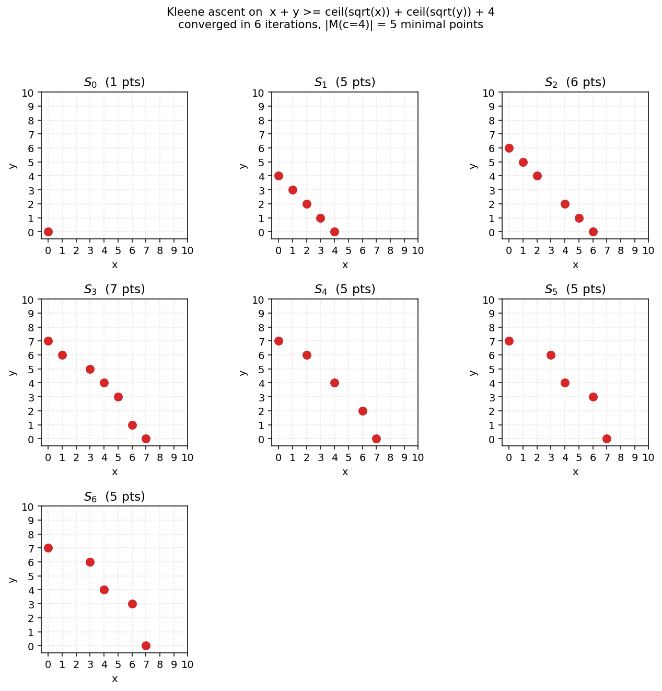

# codesign-mcdp

A Python library for **Monotone Co-Design Problems (MCDPs)**, following the
mathematical framework of Andrea Censi, *A Mathematical Theory of Co-Design*
([arXiv:1512.08055](https://arxiv.org/abs/1512.08055)). It is a from-scratch
alternative to [MCDPL](https://co-design.science/software/), built around
composable Python objects rather than a separate DSL.

A *design problem* is a relation between a **functionality** poset `F` and a
**resource** poset `R`. Given a target functionality `f`, the problem asks for
the minimal resources needed to deliver it (an antichain in `R`, the Pareto
front). Design problems compose under three operators (series, parallel,
feedback) and the resulting class is closed under composition; monotonicity is
preserved. Solutions are found by Kleene fixed-point iteration in the lattice
of antichains.



*Kleene fixed-point iteration for `x + y >= ceil(sqrt(x)) + ceil(sqrt(y)) + 4`
over `N x N`. The antichain grows monotonically from the seed `S_0 = {(0,0)}`
and converges in six iterations to the five-point Pareto front
`{(0,7), (3,6), (4,4), (6,3), (7,0)}`. See `examples/05_visualize_kleene.py`.*

## Installation

The library has no required runtime dependencies beyond the Python standard
library; only one visualization example uses matplotlib.

```bash
git clone https://github.com/<your-username>/codesign-mcdp.git
cd codesign-mcdp
pip install -e .
```

Or, equivalently, drop the `codesign/` directory on your `PYTHONPATH` and
import directly. Python 3.9 or newer is required.

## A 30-second example

A battery: given a required capacity, the minimal mass is capacity divided by
specific energy (1.8 MJ/kg for Li-ion).

```python
from codesign import Reals, NamedProduct, AlgebraicDP, solve

F = NamedProduct({"capacity": Reals(unit="J")})
R = NamedProduct({"mass": Reals(unit="kg")})

battery = AlgebraicDP(
    F=F, R=R,
    equations={"mass": lambda f: f["capacity"] / 1.8e6},
)

result = solve(battery, {"capacity": 3.6e6})  # 1 kWh
print(result)
# SolveResult(iters=0, converged=True, feasible=True)
#   Antichain[(mass=2 kg)]
```

## Composition

`series`, `par` (parallel), and `loop` (feedback) close arbitrary co-design
problems over the primitive DPs. The three operators are direct
implementations of Defs. 14, 15, 16 in the paper.

```python
from codesign import series, par, loop

chained = series(battery, shipping)     # cost-of-shipping by mass
parallel = par(battery, actuator)       # independent resources combined
feedback = loop(drone_inner, axis="battery_mass")  # close a recursive constraint
```

`loop` triggers the Kleene fixed-point iteration; everything else evaluates in
closed form.

## Modular composition with `System`

`series`, `par`, and `loop` are low-level operators on whole DPs. For larger
designs it is more natural to define each subsystem (battery, actuator,
chassis, sensor, ...) independently with its own F and R, then wire them
together with named algebraic constraints. The `System` builder does exactly
that.

```python
from codesign import AlgebraicDP, NamedProduct, Reals, System, solve

# 1. Define subsystems in isolation. Each has its own F and R.
battery = AlgebraicDP(
    F=NamedProduct({"capacity": Reals(unit="J")}),
    R=NamedProduct({"mass": Reals(unit="kg")}),
    equations={"mass": lambda f: f["capacity"] / 1.8e6},
)
actuator = AlgebraicDP(
    F=NamedProduct({"lift_force": Reals(unit="N")}),
    R=NamedProduct({"power": Reals(unit="W")}),
    equations={"power": lambda f: 10.0 * f["lift_force"] ** 2},
)

# 2. Assemble. Declare what the system as a whole provides and requires,
#    add subsystems by name, and write algebraic constraints linking
#    their ports.
sys = System("drone")
sys.provides("endurance", unit="s")
sys.provides("extra_payload", unit="kg")
sys.provides("extra_power", unit="W")
sys.requires("total_mass", unit="kg")

sys.add("battery", battery)
sys.add("actuator", actuator)

sys.constrain("battery.capacity",
              lambda x: (x["actuator.power"] + x["extra_power"]) * x["endurance"])
sys.constrain("actuator.lift_force",
              lambda x: 9.81 * (x["battery.mass"] + x["extra_payload"]))
sys.constrain("total_mass",
              lambda x: x["battery.mass"] + x["extra_payload"])

drone = sys.build()
result = solve(drone, {"endurance": 300, "extra_payload": 0.5, "extra_power": 5.0})
```

The argument `x` in each constraint is a plain dict carrying the outer
functionalities under their bare names and every subsystem R port under its
dotted name (`"battery.mass"`, `"actuator.power"`). The constraint `target >=
demand(x)` is the MCDP analogue of MCDPL's `>=` operator. Multiple constraints
on the same target are joined (max).

Under the hood, `build()` produces a single `Loop` whose axis bundles every
subsystem's R; the Kleene iteration converges over all of them
simultaneously, and the resulting DP is no different from one written in
operator form. Systems can themselves be added as subsystems of other
Systems (recursive composition).

When a subsystem returns a multi-valued antichain, for example a `CatalogDP`
with Pareto-incomparable motors, the System takes the Cartesian product
across subsystems and lets the outer Min prune dominated combinations. The
result is a genuine system-level Pareto front:

```text
Medium load: payload=10 kg, mission_energy=1 MJ
   Pareto front (2 points):
      total_mass=22.49 kg,  total_cost=$475.00   (heavier, cheaper motor)
      total_mass=20.41 kg,  total_cost=$969.00   (lighter, more expensive motor)
```

## Primitive DP types

| Type | Use it for |
|---|---|
| `AlgebraicDP` | each resource is a closed-form monotone formula in `f` |
| `FunctionDP` | the user supplies `f -> Antichain` directly (multi-valued antichains, branchy logic) |
| `CatalogDP` | choose from a finite catalog of implementations (motors, batteries, sensors) |
| `ConstraintDP` | feasibility predicate plus a scalar cost, lifted to `Min` |
| `ODE_DP` | derive the relation from a differential equation (steady state or final value) |
| `UncertainDP` | wrap a lower and an upper bracket around an unknown `h` (Sec. VII) |

## The drone example (paper's Fig. 48)

The MCDPL example from Fig. 48 of the paper closes a feedback loop between a
battery and an actuator: the battery must store enough energy to carry the
payload, but it also adds to the payload itself.

```python
# see examples/01_drone.py

drone = make_drone()   # Loop DP wrapping battery + actuator
result = solve(drone, {
    "endurance": 300.0,        # seconds
    "extra_payload": 0.5,      # kg
    "extra_power": 5.0,        # W
})
# iters=22, feasible=True, Antichain[(report_mass=0.04921 kg)]
```

When the mission becomes infeasible (e.g. 30 minutes of endurance with a 1 kg
payload), the iteration drives the loop variable to ⊤ and the result reports
`feasible=False` rather than diverging.

## Worked examples in `examples/`

* `01_drone.py` – battery + actuator with payload feedback (Fig. 48), monolithic form.
* `02_integer_optimization.py` – `x + y >= ceil(sqrt(x)) + ceil(sqrt(y)) + c` over `N x N` (Sec. VI-D).
* `03_auv_seabed.py` – AUV seabed surveying, cyclic constraints on time, energy, cost (Sec. VIII).
* `04_uncertain_and_ode.py` – `UncertainDP` brackets and `ODE_DP` steady states.
* `05_visualize_kleene.py` – plots the Kleene ascent `S_0, S_1, ...` (reproduces the structure of Fig. 36).
* `06_drone_mcdpl_syntax.py` – drone rebuilt with the MCDPL-style declarative builder.
* `07_drone_modular.py` – the same drone again with `System`, where battery and actuator are independent modules.
* `08_vehicle_modular.py` – motor catalog + chassis + battery wired with `System`, producing a multi-point Pareto front.

Run any of them with `python -m examples.NN_name`. The visualization example
also needs matplotlib (`pip install matplotlib`).

## Notebooks

Each example also has a Jupyter notebook companion under `notebooks/`, with
extra prose explaining the model and the results. The committed `.ipynb`
files include all outputs (including embedded figures from notebook 05), so
they render on GitHub without running anything. See
[`notebooks/README.md`](notebooks/README.md) for the index.

To run them locally:

```bash
pip install -e ".[viz]"
pip install jupyter
jupyter lab notebooks/
```

To regenerate them after a code change:

```bash
pip install nbformat nbconvert ipykernel matplotlib
python build_notebooks.py
```

## Solving and ranking

`solve(dp, functionality)` returns a `SolveResult`:

```python
result = solve(dp, {"capacity": 3.6e6})
result.antichain    # the Pareto front (an Antichain[R])
result.iterations   # number of Kleene steps (0 if no loop)
result.feasible     # True iff at least one finite minimal resource bundle exists
result.converged    # True iff iteration hit a fixed point within max_iter
result.trace        # the sequence S_0, S_1, ... when record_trace=True
```

When the antichain has multiple incomparable points (genuine tradeoffs),
`minimize_cost` collapses it to one design under a scalar objective:

```python
from codesign import minimize_cost

best = minimize_cost(result, cost_fn=lambda r: r["weight"] + 0.1 * r["cost"])
```

## How the solver works

`solve` dispatches on the top-level operator. For non-loop DPs the answer is
`dp.h(f)` in closed form. For a `Loop`, it runs the Kleene ascent of Prop. 4:

1. Seed `A_0 = {⊥_R}`.
2. For each point `r ∈ A_k`, evaluate the inner DP at `f ⊕ {axis: r[axis]}`,
   intersect with `↑ r`, take the union over `r`, and apply `Min`. That is
   `A_{k+1} = Φ(A_k)`.
3. Stop when `A_{k+1} = A_k` (fixed point), when `A_{k+1}` is empty
   (no feasible extension), or when every point's loop axis reaches `⊤`
   (provably infeasible).
4. Project out the loop axis to land in the outer resource poset.

The implementation includes a divergence cap to convert numerical blow-up into
infeasibility, which is essential for floating-point loops where a few
iterations of unbounded growth would otherwise overflow before the algorithm
recognises divergence.

## Modeling guidelines

A few patterns that come up repeatedly:

* **Expose loop variables you care about.** The `Loop` operator projects its
  axis out of the outer `R`. To inspect the converged loop value, include it
  in the inner `R` *under a different name* (e.g. both `battery_mass` for the
  loop axis and `report_mass` mirrored for the outer R). The `System` builder
  handles this automatically; you only need it in the operator-level API.
* **Cap physical maxima.** When a design variable has a physical ceiling
  (`v_max`, `r_max`), make `h` return a `⊤`-valued antichain once the
  iteration's loop input exceeds it. The Kleene ascent will then converge to
  infeasible rather than oscillating.
* **Generate antichain breadth from `FunctionDP` or `CatalogDP`.**
  `AlgebraicDP` always returns a single point. When you want a true Pareto
  front, use `FunctionDP` and enumerate the tradeoffs explicitly, or use a
  `CatalogDP` with several incomparable entries.
* **Scalar-objective optimization is `minimize_cost` over the antichain.**
  The MCDP solver returns the Pareto front; the engineer's choice of which
  point to ship is a downstream scalarization.

## Architecture

```
codesign/
  posets.py        Reals, Naturals, NamedProduct, Discrete
  antichains.py    Antichain: normalised, Min-closed, with union_min and filter_above
  dp.py            DesignProblem, AlgebraicDP, FunctionDP, CatalogDP, ConstraintDP, ODE_DP, UncertainDP
  composition.py   Series, Parallel, Loop  (and series, par, loop aliases)
  primitives.py    adder, multiplier, scale, constant, identity
  solver.py        kleene_loop, solve, minimize_cost, SolveResult
  mcdpl.py         MCDP builder, MCDPL-style provides/requires/constraint
  system.py        System builder, modular composition of named subsystems
```

The dependency graph is acyclic: `posets <- antichains <- dp <- composition`,
with `solver` reading all four. `mcdpl` and `system` are thin builders on top.

## Running the tests

```bash
python -m tests.test_smoke
```

A CI workflow at `.github/workflows/test.yml` runs the same smoke test on
every push.

## What this is and isn't

This is a from-scratch implementation of the *algorithmic* core of the paper:
the antichain calculus, the three composition operators, the Kleene
fixed-point iteration that closes loops, and a modular builder for assembling
multi-subsystem designs. It does **not** ship:

* the original MCDPL parser and its concrete `mcdp { ... }` text syntax (the
  `MCDP` builder in `mcdpl.py` provides the same shape in Python),
* approximation strategies for non-finitely-representable antichains beyond
  the bracket pattern of `UncertainDP`,
* visualization of the design graph itself.

These are tractable extensions on top of the current core.

## License

MIT. See [LICENSE](LICENSE).

## References

* Andrea Censi, *A Mathematical Theory of Co-Design*, arXiv:1512.08055 (2015).
* Davey and Priestley, *Introduction to Lattices and Order*, CUP (2002).
